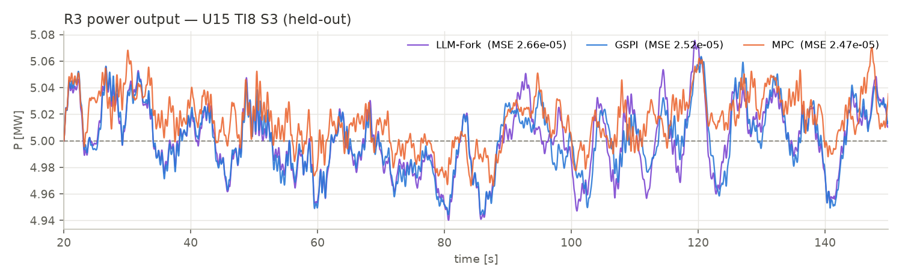
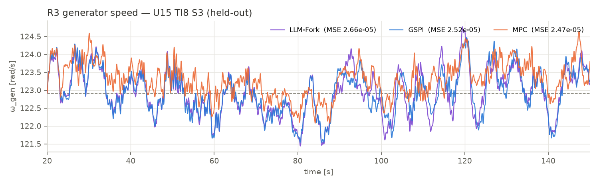
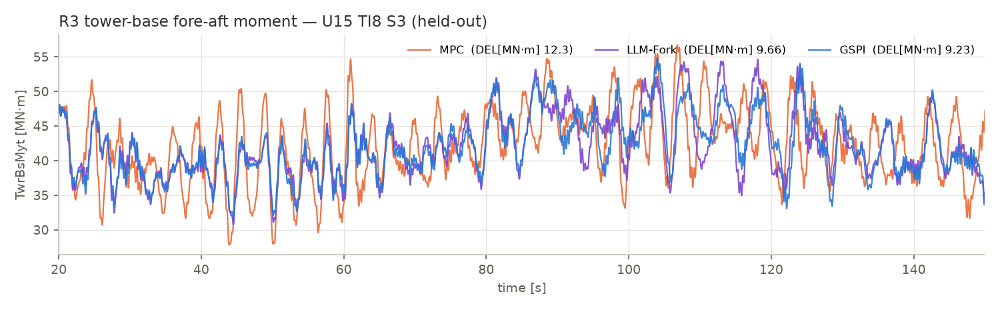
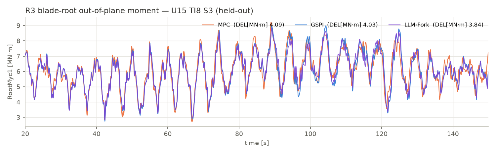

# Region-aware Agentic RL on Wind Turbine

Residual reinforcement learning for collective-pitch control of the NREL 5 MW turbine in OpenFAST,
built on top of ROSCO's gain-scheduled PI (GSPI): operating-region-specialised PPO residual agents
(R2 below rated / R3 above rated, split by an oracle rule) with an LLM supervisor tuning six
reward/action knobs at a slow timescale. Baseline paper: Wang/Dong/Zhao, IEEE TSTE 2026
(Region-III-only residual RL on the IEA 15 MW); our extensions are the region split, the
constraint-tiered evaluation, and the agentic supervision layer.

Detailed, dated records: `docs/REPORT_2026-09-01.md` (verified findings F1–F7),
`docs/roadmap_2026-08-30.md` (day-by-day experiment log, §1–15),
`docs/litreview_schedule_paradigm_2026-09-01.md` (supervision-paradigm literature review).

## System

- **Plant**: NREL 5 MW onshore, OpenFAST 4.2.1, ROSCO v2.10.5 patched (22-channel ZMQ measurements,
  torque-offset application, WSE sees applied torque). Constant torque above rated (paper-consistent),
  PS_Mode 1, 10 ms control step. A 1-DOF toy twin drives the same `libdiscon` for cheap screening.
- **Architecture**: GSPI + region-gated residual Δβ (oracle rule: native pitch cmd > current pitch
  floor + 0.5° held 1 s ⇒ R3, with hysteresis), second-order critically damped smoothing, safety
  clamps. One PPO per region (`spec`); `mono`/`mono_flag`/`r3only` as controls.
- **Unified region-conditional reward**: R2 power term, R3 speed term, load term
  `−λ_L · range_inc` (10 s trailing peak-to-peak increment of the load signal), action penalty.
- **Fitness F (unmodifiable by any learner/supervisor)**: see *Evaluation metrics* below.
- **Supervisors** (every 30 episodes, evaluated on train-side wind seeds): `guard` (fixed knobs),
  `llm_fork` (LLM proposes 3 candidates, each fork-trained one wave and verified, best kept),
  `random_fork` (same forks, random candidates), `schedule` / `schedule_comp` (replay of a
  distilled knob curriculum, episode- or competence-indexed).

## Evaluation metrics

**Ground-truth fitness F** (`eval/fitness.py`; constraint form, fixed 2026-08-29; no learner or
supervisor can modify it). Everything is measured on deterministic evaluation episodes against the
seed-paired GSPI baseline (same wind file, same TurbSim seed):

```
F = DEL_red_pct − 20 · max(0, energy_loss_pct − 1.0) − 20 · max(0, 100 · (speed_std_ratio − 1))
```

- *objective* `DEL_red_pct`: percentage reduction of the target damage-equivalent load —
  tower-base fore-aft `TwrBsMyt` (m = 4) for the tower objective, blade-root out-of-plane
  `RootMyc1`/`RootMoop` (m = 10) for the blade objective; rainflow-counted (fatpack).
- *constraint 1*: episode energy loss vs GSPI ≤ 1 % (all episodes);
- *constraint 2*: generator-speed std not worse than GSPI on R3-dominated episodes (≥ 50 % R3 steps);
- every percentage point of constraint violation costs 20 points of DEL reduction.

**Tiers**: **strict** = speed std ratio ≤ 1.0 and energy loss ≤ 1 % (non-inferior to ROSCO);
**tol2** = speed std ratio ≤ 1.02 (engineering-equivalent); **degraded** otherwise. `F_strict`
applies the penalty at ratio 1.0, `F_tol2` at 1.02; both are always reported, and any
"beats GSPI" claim in this repo is bound to its tier.

**Baseline-paper metric set** (Wang/Dong/Zhao): power-output MSE, generator-speed MSE (with MAE as
companion), tower-base fore-aft DEL, blade-root out-of-plane DEL — all reported as percentage
reduction vs GSPI (`scripts/dev/paper_table.py`); energy loss is our addition (the Region-III-only
paper holds torque constant and does not track it).

## Headline results (CPC + region-aware, held-out wind S3–S6, best checkpoint)

**1. Region specialisation wins, and only under constraints (F1).** All nine supervised `spec`
runs are strict on unseen wind and improve *all four* paper metrics simultaneously vs GSPI
(power MSE +0.5…+22 %, speed MSE same, tower DEL +10…+23 %, blade DEL +2.8…+8 %, energy cost
0.07–0.68 %). `mono` is 0/9 strict — it trades speed regulation (worse than GSPI in every seed)
for load reduction that is *not* larger than spec's. The conclusion is tier-dependent by design.

**2. Supervision helps; the supervisor's identity does not (F5, 5 RL seeds).**

| supervisor | F per seed (s0…s4) | mean ± std | strict |
|---|---|---|---|
| llm_fork | 17.4, 9.8, 18.8, 18.0, 13.6 | 15.5 ± 3.8 | 5/5 |
| random_fork | 12.7, 11.0, 23.2, 16.5, 8.1 | 14.3 ± 5.8 | 5/5 |
| guard (fixed λ=1, 3 seeds) | 11.5, 12.6, 15.6 | 13.2 ± 1.7 | 2/3 |

Fork-verified LLM vs verified random search: paired p = 0.55 (permutation p = 0.50); the observed
+1.2 F effect would need ~90 seeds. The LLM's attributable contributions are the λ-curriculum it
discovered and its diagnostics — not per-decision superiority. Unverified single-proposal LLM
supervision is actively harmful (strict on training seeds, violated on held-out).

On the **baseline paper's metric set** (held-out S3–S6, best ckpt, % reduction vs paired GSPI,
mean ± std over the 3 night1 RL seeds; roadmap §12):

| method | Power MSE ↓% | GenSpd MSE ↓% | TwrBsMyt DEL ↓% | RootMyc1 DEL ↓% | Energy loss % | tiers |
|---|---|---|---|---|---|---|
| guard | 7.4 ± 6.7 | 7.4 ± 6.7 | 13.2 ± 1.7 | 3.6 ± 1.2 | 0.23 | s,s,t |
| llm_fork | 4.2 ± 2.1 | 4.2 ± 2.1 | 15.4 ± 4.0 | 4.5 ± 1.1 | 0.26 | s,s,s |
| random_fork | 2.6 ± 2.9 | 13.7 ± 9.4 * | 15.7 ± 5.4 | 5.9 ± 2.2 | 0.37 | s,s,s |
| schedule | 8.2 ± 4.4 | 8.2 ± 4.4 | 15.6 ± 0.3 | 4.6 ± 1.0 | 0.27 | s,s,s |
| mono | **−3.2 ± 1.1** | **−3.2 ± 1.1** | 14.5 ± 2.2 | 5.2 ± 2.1 | 0.38 | t,t,d |

\* random_fork s0/s1 push some 12.5 m/s episodes above 50 % R3 occupancy, where torque varies below
rated and power/speed MSE decouple; all other rows operate constant-torque and the two columns are
identical by construction. R3 speed-**MAE** ratios track the std ratios closely (0.86–1.00 for the
supervised variants, i.e. the paper's tracking metric improves 1–14 % while tower DEL drops
10–23 %). Versus the paper's own 15 MW numbers (power/speed MSE −23 %, tower −4.5 %, blade −0.2 %):
our regulation gains are smaller and our load gains much larger — a consequence of the
load-prioritising objective and the 5 MW plant; not directly comparable.

**3. Schedule replay is robust — because of the protection layer (roadmap §14).** Replaying a
distilled knob curriculum on fresh seeds: episode-indexed 15.6 ± 3.7, competence-indexed
15.1 ± 4.0, both 10/10 strict, matching llm_fork at zero API cost — contradicting IPBT's
(arXiv 2511.09190) negative RL replay result, but only thanks to the violation-rollback guardrail
plus best-checkpoint selection (1–6 rollbacks per run). Competence re-indexing adds nothing when
the guardrail is active. Variance is a property of the curriculum content, not the paradigm
(an earlier σ = 0.4 claim was retracted).

**4. R2 torque residual: clear negative (roadmap §15).** Seed-paired 5 + 5:

| arm | F mean ± std | strict | energy loss |
|---|---|---|---|
| pitch only | 13.9 ± 2.3 | 5/5 | 0.26 % |
| + torque (±2000 Nm, gated, KE-exact reward) | 4.1 ± 2.9 | 5/5 | 0.05 % |

Paired p = 0.007. The channel nearly eliminates an energy cost that was never binding, while the
extra action dimension dilutes pitch learning within the 300-episode budget. Two mathematically
real reward loopholes were identified and guarded on the way (overspeed farming through the
region label; kinetic-energy draining), plus one critical infrastructure bug
(action-buffer misalignment for multi-dim actions) — see roadmap §15 for the honest chronicle.

**5. LPV-MPC baseline (roadmap §16).** Comparison baselines are **GSPI + MPC** (decision
2026-09-03; the Wang et al. paper numbers return as a reference once IPC lands). The MPC is a
3-state LPV controller (rotor + first tower fore-aft mode, Cp/Ct-table linearisation each 0.1 s,
OSQP, live peak-shaving floor, no preview), tuned on the supervisor winds by F — the same model
selection every method gets. Held-out S3–S6:

| method | F | Pwr MSE ↓% | Spd MSE ↓% | TwrBsMyt DEL ↓% | RootMyc1 DEL ↓% | Eloss % | spd std ratio |
|---|---|---|---|---|---|---|---|
| GSPI (ref) | 0 | 0 | 0 | 0 | 0 | 0 | 1.000 |
| LPV-MPC (tuned) | **−17.6** | +7.5 | +4.2 | **−17.6** | −0.7 | −0.30 | **0.912** |
| spec + guard (5 seeds) | +13.9 ± 2.3 | +6.2 | +6.2 | +13.9 | +4.4 | +0.26 | 0.968 |
| spec + schedule (5 seeds) | +15.6 ± 3.7 | −2.4 | +6.0 | +15.6 | +5.1 | +0.36 | 0.968 |
| spec + llm_fork (2 local seeds) | +15.8 | +1.7 | +1.6 | +15.8 | +5.4 | +0.33 | 0.991 |

The MPC reproduces (amplified) the classic trade-off: best regulation of all methods, paid for
with tower fatigue — a regulation-optimal pitch loop pumps the ~0.32 Hz tower mode. The
region-aware RL rows Pareto-dominate it on the combined objective. Ours is deliberately a simple
MPC (no preview, no load terms — fatigue is not expressible as a QP cost, and a naive
tower-velocity term drives the optimum to feathering); on the 1-DOF toy twin, where its model is
exact, the same MPC beats everything (speed std 0.03 vs GSPI 0.48) — its shortfall on OpenFAST is
model mismatch plus the non-quadratic objective, which is precisely the gap the residual-RL fills.

### R3 trajectories (held-out episode U15 TI8 S3)

Single above-rated episode, all three controllers on identical wind; in each figure the
best-scoring method (per-figure metric in the legend) is drawn on top.






Reading note: at a pure-R3 wind the three methods are nearly tied on power/speed MSE (MPC
slightly best, as designed), while the MPC's tower DEL is visibly the worst (12.3 vs 9.2 MN·m);
the RL methods' tower-base *gains* live mostly in the R2/transition winds (F2), so these R3
figures show the regulation story, not the load story.

**6. Hard-won implementation facts (F3, F4, F7).** PPO γ must be 0.998 at 10 ms steps (0.99 is
myopic w.r.t. the ~3 s tower mode and every method fails); the load reward must be the trailing
peak-to-peak increment (`range_inc`) — |M| and |ΔM| both destabilise; λ_L has a cliff (start ≤ 1,
raise only after competence — the curriculum effect, first found by the LLM); `ckpt_last` is
frequently degraded, best-checkpoint selection is essential; the toy twin screens mechanisms and
rewards but its policies do not transfer zero-shot.

**Boundaries.** Numbers are not directly comparable to the Wang et al. 15 MW results (different
plant and objective weights: we prioritise loads); their paper serves as method reference, not a
numeric baseline, until IPC lands. Wind bank was regenerated on migration (2026-09-01);
cross-machine F values are not seed-paired. MPC rows use wind-relabeled pairing (both sides),
since the oracle region label keys off ROSCO's native command.

## Status / ongoing

- CPC + agentic supervision is concluded at the 3–5-seed statistical budget (variants tied).
- **IPC (dq-frame cyclic-pitch residual for R3)** in progress: Coleman-transform channel validated
  physically (a hand-tuned I-controller already gives blade-root DEL −22 % at 15 m/s; ±1°/axis,
  R3-gated); ipc_on vs ipc_off campaign (blade objective, 5 + 5 seeds) running.
- MPC baseline: done (see above); IPC campaign paused for it, resumable.
- Queued: robustness evaluation (higher TI / ETM wind classes on existing checkpoints),
  learned router, 15 MW extension.

## How to run

Linux/WSL: `bash scripts/wsl/bootstrap.sh` (micromamba env, patched ROSCO build, case template,
wind bank, GSPI baselines). macOS: same conda-forge stack, see `scripts/mac/finish_bootstrap.sh`
and the notes in `CLAUDE.md`. Training/evaluation entry points: `scripts/train.py`,
`scripts/evaluate.py`; campaign runners under `scripts/wsl/` and `scripts/mac/`; tables via
`scripts/summarize.py` and `scripts/dev/*_table.py`. LLM supervision needs an `.env` with
`LLM_BASE_URL / LLM_API_KEY / LLM_MODEL` (never committed).
